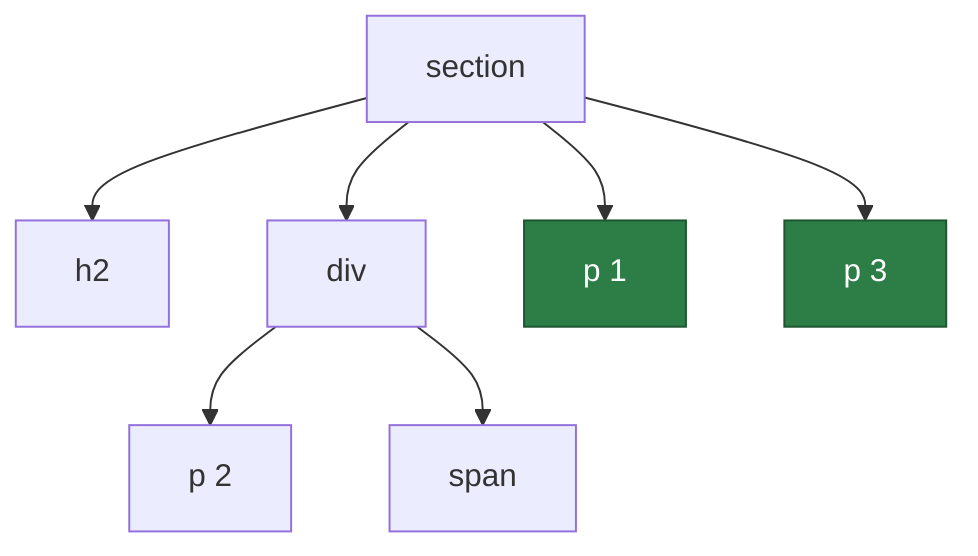
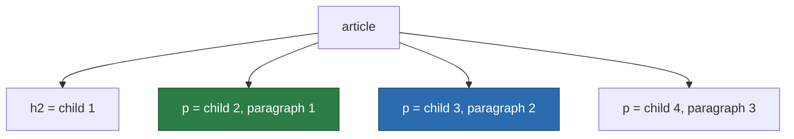
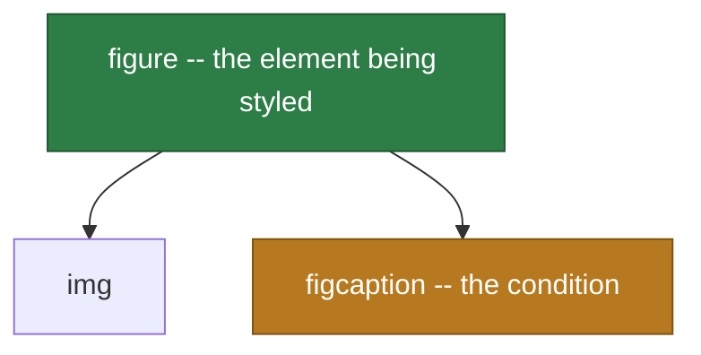

Most people write CSS with four selectors — the tag name, the class, the ID, and a space between two of them — and improvise the rest by adding another class whenever the styling refuses to land. That works, right up until you need the third item in a list, or every input that follows a checked checkbox, or a card that happens to contain an image.

The full selector grammar is not large. It is a handful of symbols — `>`, `+`, `~`, `[]`, `:`, `::` — and a counting syntax that looks worse than it is. What follows walks through all of it, in the order the pieces build on each other.

## Matching by name, class and ID

Three selectors do most of the work, and one matches everything:

```css
p        { }   /* type selector: every <p> */
.card    { }   /* class selector: class="card" */
#header  { }   /* ID selector: id="header" */
*        { }   /* universal selector: every element */
```

Written next to each other with no space, they form a **compound selector** — a set of conditions that must all hold for the same element:

```css
a.button          { }   /* an <a> that also has class="button" */
input.field.error { }   /* both classes, on one <input> */
```

The space matters enormously here. `a.button` is one element satisfying two conditions; `a .button` is two elements in an ancestor relationship. This is the most common typo in CSS, and it fails silently.

ID selectors are best avoided in day-to-day styling, and the reason is specificity.

## Specificity, briefly

When two rules set the same property on the same element, the more specific selector wins regardless of source order. Specificity is counted as three numbers, compared left to right:

| Component | Counts in | Examples |
| --- | --- | --- |
| ID | the first column | `#header` |
| Class, attribute, pseudo-class | the second | `.card`, `[type="text"]`, `:hover` |
| Type, pseudo-element | the third | `div`, `::before` |

The universal selector `*` and the combinators contribute nothing. Inline `style` attributes outrank all of it, and `!important` sits outside the system entirely.

So `#header .title` (1-1-0) beats `.page .header .title span` (0-3-1), no matter how much more precise the second one looks. A single ID is unbeatable by any quantity of classes, which is why a stylesheet built on IDs tends to escalate into `!important` within a few months. Classes keep the numbers flat and the cascade arguable.

## Selector lists

A comma applies one block to several independent selectors:

```css
h1, h2, h3 { margin-block: 0; }
```

The comma is not a combinator — it describes no relationship, it just avoids repetition. One caveat: if the browser cannot parse **any** selector in a plain comma-separated list, it discards the entire rule. `:is()` and `:where()`, further down, fix exactly that.

## Combinators

Combinators describe how two elements relate in the document tree. Take a `section` holding a heading, a `div`, and three paragraphs — one of them nested inside the `div`:



The highlighted paragraphs are the ones `section > p` matches. All four combinators, read against that same tree:

```css
section p    { }   /* descendant: p 1, p 2 and p 3 */
section > p  { }   /* child: p 1 and p 3 only */
h2 + div     { }   /* adjacent sibling: the div */
h2 ~ p       { }   /* general sibling: p 1 and p 3 */
```

A **space** is the descendant combinator — any depth below. `>` narrows that to direct children, which is what you want whenever a component might contain a nested copy of itself.

`+` matches the element immediately after another at the same level. `h2 + p` matches nothing in that tree, because the `div` sits between them. `~` relaxes the requirement to *any* later sibling, so the intervening `div` stops mattering.

There is no combinator for the reverse direction — nothing selects a previous sibling or a parent. That gap is what `:has()` closes.

## Attribute selectors

Square brackets match on attributes, with or without a value test:

| Selector | Matches when |
| --- | --- |
| `[href]` | the attribute is present, whatever its value |
| `[type="checkbox"]` | the value is exactly this |
| `[class~="card"]` | the value is a space-separated list containing this word |
| `[lang\|="en"]` | the value is this, or this followed by a hyphen — `en`, `en-GB` |
| `[href^="https"]` | the value starts with this |
| `[src$=".svg"]` | the value ends with this |
| `[href*="example"]` | the value contains this anywhere |

The `~=` and `|=` forms are the two that get forgotten. `~=` exists because `class` is a list, and `|=` exists for language subtags, which is why it treats a hyphen as a boundary.

`^=`, `$=` and `*=` are plain substring tests, and they are case-sensitive in HTML documents unless the attribute is one that HTML itself defines as case-insensitive. A trailing flag settles it explicitly:

```css
a[href$=".PDF" i] { }   /* case-insensitive */
a[href*="cAsE" s] { }   /* force case-sensitive */
```

The `i` flag is broadly supported. `s` is much rarer, so treat it as a nicety rather than something to depend on.

Note that `[class~="card"]` is a longer way to write `.card`, and `[id="header"]` is a lower-specificity `#header` — the latter is occasionally useful precisely because it drops out of the ID column and into the class column.

## Link and interaction states

Attribute selectors match what the HTML says. State pseudo-classes match what the element is *doing* right now, and the pair is worth noticing: `button[disabled]` and `button:disabled` reach the same buttons by different routes.

Five cover links and pointer interaction:

```css
a:link    { }   /* an anchor with an href, not yet visited */
a:visited { }   /* one the user has been to */
a:hover   { }   /* the pointer is over it */
a:active  { }   /* mid-click, between press and release */
a:focus   { }   /* focused by click, tab or script */
```

Order matters here, because several can be true at once and they carry identical specificity — so whichever is written last wins. The conventional sequence is `:link`, `:visited`, `:focus`, `:hover`, `:active`. Put `:visited` after `:hover` and hovering a visited link will appear to do nothing.

`:visited` is also deliberately crippled. Because reading its computed style would leak browsing history, browsers restrict it to a short list of colour properties and lie to `getComputedStyle` about the result. You cannot change its size, give it a background image, or match it inside `:has()`.

Two later additions are usually what you actually want:

```css
button:focus-visible { outline: 2px solid; }
form:focus-within    { background: #f6f6f6; }
```

`:focus-visible` matches only when the browser judges that a focus ring ought to be shown — keyboard navigation yes, a mouse click on a button no. That resolves the old dilemma between an outline that irritates mouse users and no outline at all, which strands keyboard users. It has been widely available since March 2022. `:focus-within` matches an element that *contains* the focused element, so a form can highlight itself while any field inside it is active.

## Form and validation states

The form pseudo-classes read live state out of the browser's own validation machinery, which means a good deal of feedback needs no JavaScript at all.

| Selector | Matches |
| --- | --- |
| `:enabled` / `:disabled` | a control that is, or is not, accepting input |
| `:checked` | a checked radio or checkbox, and a selected `<option>` |
| `:indeterminate` | a checkbox set indeterminate from script, a radio group with nothing chosen, a `<progress>` with no value |
| `:default` | the default choice within a group — see below |
| `:required` / `:optional` | a control with, or without, the `required` attribute |
| `:valid` / `:invalid` | contents that do or do not satisfy the control's type and constraints |
| `:in-range` / `:out-of-range` | a value inside or outside the `min`/`max` bounds |
| `:read-write` / `:read-only` | editable, or not |

Several of these are narrower — or wider — than their names suggest.

`:default` is not "an element in its default state". It is the default *of its group*: the radio or checkbox carrying the `checked` attribute in the markup, the first selected `<option>`, the form's default submit button. It keeps pointing at that original element even after the user chooses something else, which is exactly what makes it useful for marking the recommended option.

`:in-range` and `:out-of-range` apply only to inputs that genuinely have a `min` or `max` — a plain text field is neither one. An empty input is also neither, so an untouched required number field will not turn red from `:out-of-range`. That is `:invalid`'s job.

`:read-only` is defined as everything `:read-write` does not match, which makes it far broader than forms. An ordinary paragraph is `:read-only`; a paragraph with `contenteditable` is `:read-write`. When you mean "an input carrying the readonly attribute", write `input:read-only`.

Validation styling has one practical trap. `:invalid` matches from page load, so an empty required field is flagged as an error before the user has typed anything. Pair it with `:placeholder-shown` to hold off until there is something to judge:

```css
input:invalid:not(:placeholder-shown) { border-color: crimson; }
input:required:valid                  { border-color: seagreen; }
```

## Counting children

This family selects elements by their position among their parent's children:

```css
li:first-child       { }
li:last-child        { }
li:only-child        { }
li:nth-child(3)      { }
li:nth-last-child(2) { }   /* counting from the end */
```

Read these carefully, because the names suggest the wrong thing. `li:first-child` does not mean "the first `li`". It means "an `li` that happens to be the first child of its parent" — if a heading sits above the list items, nothing matches at all. That is the mistake the next section exists to fix.

`:nth-child()` takes a formula, `An+B`, where `n` runs 0, 1, 2, 3… and every result landing on a real position matches:

```css
li:nth-child(2n)   { }   /* 2, 4, 6…  — same as :nth-child(even) */
li:nth-child(2n+1) { }   /* 1, 3, 5…  — same as :nth-child(odd)  */
li:nth-child(3n+1) { }   /* 1, 4, 7…  — the start of each row of three */
li:nth-child(-n+3) { }   /* the first three */
li:nth-child(n+4)  { }   /* the fourth onwards */
```

The last two are the trick worth memorising: a negative coefficient counts downwards and so gives you a "first N", while a bare `n+B` gives you everything from B on. Chain them to take a slice — `li:nth-child(n+3):nth-child(-n+6)` is items three through six.

There is also an `of S` form, which changes what gets counted:

```css
li:nth-child(-n+3 of .featured) { }
```

That matches the first three *featured* items, wherever they sit in the list. Written the other way round, `li.featured:nth-child(-n+3)` filters the first three children down to those that are featured — usually not what you meant. The `of S` form landed in the last browser in 2023, so it is about as fresh as `:has()` below.

## Counting by type

Every selector above has a `-of-type` twin that counts only siblings sharing the same element name:

```css
p:first-of-type       { }
p:last-of-type        { }
p:only-of-type        { }
p:nth-of-type(2)      { }
p:nth-last-of-type(2) { }
```

The difference is worth a picture. Given an `article` whose children are a heading followed by three paragraphs:



`p:nth-child(2)` matches the green one — child number two, which happens to be a paragraph. `p:nth-of-type(2)` matches the blue one — the second paragraph, whatever its position among the children. And `p:first-child` matches nothing at all here, because child number one is the `h2`.

The rule of thumb: reach for the `-child` family when position inside the container is the thing you care about, such as striping a table or a grid. Reach for `-of-type` when you mean "the first paragraph" and cannot control what else the container holds.

`:only-child` and `:only-of-type` divide along the same line. An element is an only child when it is its parent's sole child; it is the only one of its type when no sibling shares its tag name, even if other elements are present.

## Quantity queries

Chaining two counting pseudo-classes onto the same element turns them into a test of *how many* siblings there are — a container query for element count, written years before container queries existed.

The trick rests on `:nth-child()` counting from the start while `:nth-last-child()` counts from the end. Requiring both at once pins down the total:

```css
li:nth-child(7):last-child { }
```

An `li` that is simultaneously the seventh child and the last child can only exist in a list of exactly seven. In a list of six or eight, the rule matches nothing.

That styles one item. To style the whole set, match the first item under the same condition and then sweep up its siblings with `~`:

```css
li:first-child:nth-last-child(3),
li:first-child:nth-last-child(3) ~ li { }
```

"A first child that is also third from the end" describes a list of exactly three; the second selector then catches the other two. Change the formula to change the test — `:nth-last-child(n+3)` for three *or more*, `:nth-last-child(-n+3)` for three or fewer, and both together for a range:

```css
li:first-child:nth-last-child(n+2):nth-last-child(-n+4),
li:first-child:nth-last-child(n+2):nth-last-child(-n+4) ~ li { }
```

That matches only when the list holds between two and four items. The usual application is a layout that should change shape past a certain count — cards side by side until there are five of them, at which point they wrap into a grid — without asking JavaScript to count anything.

## Logical pseudo-classes

Four pseudo-classes take a selector list as their argument, and they are the most useful recent addition to the language.

`:not()` inverts a match. Since Selectors Level 4 it accepts a full list, so one call covers several exclusions:

```css
button:not(.primary, .danger) { }
li:not(:last-child)           { border-bottom: 1px solid; }
```

`:is()` matches if any selector in the list matches, which collapses combinatorial repetition:

```css
:is(article, aside, section) :is(h1, h2, h3) { margin-block-start: 1.5rem; }
```

Its specificity is that of its **most specific** argument, which occasionally bites — `:is(#main, p)` weighs as much as `#main` even on the occasions it matched the `p`.

`:where()` is `:is()` with the specificity forced to zero. That makes it the right tool for defaults and resets, because anything written later beats it without needing `!important`:

```css
:where(h1, h2, h3) { margin: 0; }
```

Both lists are **forgiving**: an unrecognised selector inside them is skipped instead of invalidating the rule. That is a safe way to use a newer selector while keeping a fallback in the same stylesheet.

`:has()` is the one that changes what is possible. It matches an element based on what that element contains, so the thing you style is the one *before* the colon:



The argument is relative to that element, so combinators inside it are read starting from there:

```css
figure:has(figcaption)     { }   /* a figure containing a caption, at any depth */
label:has(> input:invalid) { }   /* only a direct child input */
h2:has(+ p)                { }   /* an h2 immediately followed by a paragraph */
```

That last one is the previous-sibling selector CSS never had, arrived at from the other end. `:has()` has been widely available since December 2023. Two restrictions to know: it cannot be nested inside another `:has()`, and pseudo-elements are valid neither as its argument nor as its subject.

## :empty and a few strays

`:empty` matches elements with no child elements **and** no text — and whitespace counts as text, so an element written across two lines with indentation between the tags is not empty. Comments are ignored, so they do not break it.

```css
td:empty { background: #f4f4f4; }
```

It is a good way to reveal placeholder markup a template forgot to fill, and a reliable source of confusion when a stray newline keeps it from matching.

Three more worth knowing alongside the structural ones. `:root` matches the document root — `<html>` — and is where custom properties usually live. `:target` matches the element whose ID is currently in the URL fragment, which gets you pure-CSS disclosure widgets. `:lang(en)` matches by language, following the same prefix logic as `[lang|="en"]` but respecting inheritance from an ancestor's `lang` attribute.

## Pseudo-classes versus pseudo-elements

Everything above uses a single colon, because it selects a real element on the basis of some state or position. A double colon selects something that is not in the document at all:

```css
p::first-line      { }
p::first-letter    { }
li::marker         { }
::selection        { }
input::placeholder { }

blockquote::before { content: "\201C"; }
blockquote::after  { content: "\201D"; }
```

`::before` and `::after` create a box inside the element, before and after its content, and do nothing whatsoever without a `content` property — `content: ""` is the usual value when the box exists only to be styled. Neither works on a replaced element such as ``, `<input>` or `<br>`, because those have no content box to insert into; wrap the element in a container if you need generated content around it.

You will still see `:before` and `:after` written with one colon. That is the original CSS2 syntax, kept alive for compatibility, and the four original pseudo-elements accept either form. Write the double colon anyway, because nothing added since supports the short version.

The distinction has one more practical consequence: a pseudo-element can only appear at the very end of a selector, which is why it can never sit inside `:has()` or be followed by a combinator.

## Three patterns worth stealing

`* + *` — the "lobotomised owl" — matches every element that follows another element, which is to say every child except the first. It sets spacing *between* siblings without leaving a stray margin at the top of the container:

```css
.stack > * + * { margin-block-start: 1.5rem; }
```

Scoping it with `>` as above is the version to use. The bare `* + *` applies to every element in the document and is a very blunt instrument.

The **checkbox hack** combines `:checked` with a sibling combinator to build custom controls with no script at all. A `<label>` whose `for` matches an input's `id` toggles that input when clicked, so you can hide the real checkbox and style the label in its place:

```css
input[type="checkbox"]          { position: absolute; opacity: 0; }
input[type="checkbox"] + label  { background: #333; }
input[type="checkbox"]:checked + label { background: orange; }
```

Keep the input in the document and merely invisible. `display: none` removes it from the accessibility tree and from keyboard focus, which breaks the control for anyone not using a mouse; `opacity: 0` with `position: absolute` keeps it focusable. Add a `:focus-visible` rule on the label to restore the focus ring.

Finally, `attr()` pulls an attribute's value into generated content:

```css
@media print {
  a[href^="http"]::after { content: " (" attr(href) ")"; }
}
```

A printed page loses its link targets; this puts them back. `attr()` inside `content` has been reliable since 2015. Using it in other properties is a newer, still experimental extension, so treat `content` as the case you can depend on.

## Where to go next

The specification behind all of this is [Selectors Level 4](https://www.w3.org/TR/selectors-4/), and [MDN's selector reference](https://developer.mozilla.org/en-US/docs/Web/CSS/CSS_selectors) is the practical version of the same material, with a browser support table on every page. When a selector silently does nothing, browser devtools beat reasoning about it: paste the selector into the element inspector's search box and see how many nodes light up.
