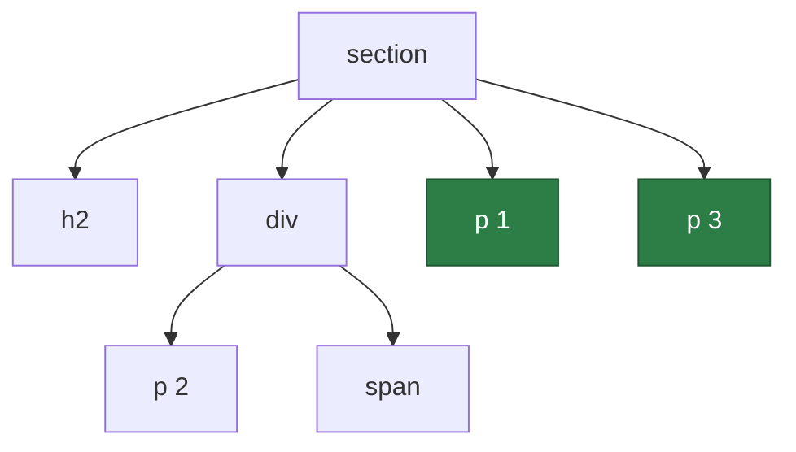
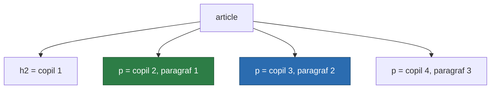
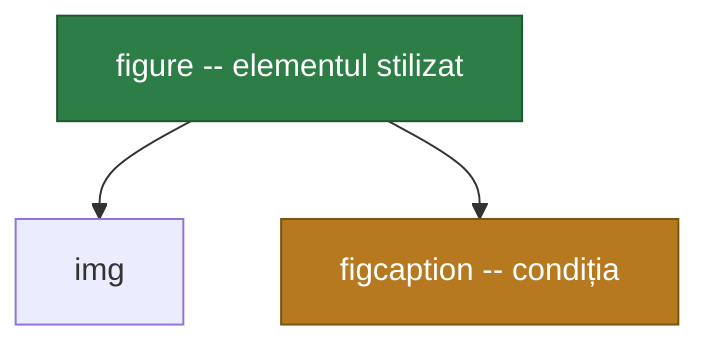

Majoritatea oamenilor scriu CSS cu patru selectori — numele tag-ului, clasa, ID-ul și un spațiu între doi dintre ei — iar restul îl improvizează adăugând încă o clasă ori de câte ori stilul refuză să se aplice. Merge, până în momentul în care ai nevoie de al treilea element dintr-o listă, de fiecare input care urmează după un checkbox bifat, sau de un card care se întâmplă să conțină o imagine.

Gramatica completă a selectorilor nu este mare. Sunt câteva simboluri — `>`, `+`, `~`, `[]`, `:`, `::` — și o sintaxă de numărare care arată mai rău decât este. Ce urmează parcurge tot, în ordinea în care piesele se construiesc una peste alta.

## Potrivirea după nume, clasă și ID

Trei selectori fac cea mai mare parte a muncii, iar unul le potrivește pe toate:

```css
p        { }   /* type selector: fiecare <p> */
.card    { }   /* class selector: class="card" */
#header  { }   /* ID selector: id="header" */
*        { }   /* universal selector: fiecare element */
```

Scriși unul lângă altul, fără spațiu, formează un **selector compus** — un set de condiții care trebuie să fie adevărate toate pentru același element:

```css
a.button          { }   /* un <a> care are și class="button" */
input.field.error { }   /* ambele clase, pe un singur <input> */
```

Spațiul contează enorm aici. `a.button` înseamnă un singur element care satisface două condiții; `a .button` înseamnă două elemente aflate într-o relație de descendență. Este cea mai frecventă greșeală de tastare din CSS și eșuează în tăcere.

Selectorii de tip ID sunt de evitat în stilizarea de zi cu zi, iar motivul este specificitatea.

## Pe scurt despre specificitate

Când două reguli setează aceeași proprietate pe același element, câștigă selectorul mai specific, indiferent de ordinea din fișier. Specificitatea se numără ca trei numere, comparate de la stânga la dreapta:

| Componentă | Contează în | Exemple |
| --- | --- | --- |
| ID | prima coloană | `#header` |
| Clasă, atribut, pseudo-clasă | a doua | `.card`, `[type="text"]`, `:hover` |
| Tip, pseudo-element | a treia | `div`, `::before` |

Selectorul universal `*` și combinatorii nu contribuie cu nimic. Atributul `style` scris inline le depășește pe toate, iar `!important` stă complet în afara sistemului.

Așa că `#header .title` (1-1-0) bate `.page .header .title span` (0-3-1), oricât de precis ar părea al doilea. Un singur ID nu poate fi învins de nicio cantitate de clase, motiv pentru care un stylesheet construit pe ID-uri ajunge la `!important` în câteva luni. Clasele mențin numerele mici, iar cascada rămâne negociabilă.

## Liste de selectori

O virgulă aplică un singur bloc mai multor selectori independenți:

```css
h1, h2, h3 { margin-block: 0; }
```

Virgula nu este un combinator — nu descrie nicio relație, doar evită repetiția. O singură atenționare: dacă browserul nu poate interpreta **vreunul** dintre selectorii dintr-o listă simplă separată prin virgule, aruncă regula întreagă. `:is()` și `:where()`, mai jos, rezolvă exact asta.

## Combinatorii

Combinatorii descriu relația dintre două elemente în arborele documentului. Ia un `section` care conține un titlu, un `div` și trei paragrafe — unul dintre ele imbricat în `div`:



Paragrafele evidențiate sunt cele pe care le potrivește `section > p`. Toți cei patru combinatori, citiți pe același arbore:

```css
section p    { }   /* descendant: p 1, p 2 și p 3 */
section > p  { }   /* child: doar p 1 și p 3 */
h2 + div     { }   /* adjacent sibling: div-ul */
h2 ~ p       { }   /* general sibling: p 1 și p 3 */
```

Un **spațiu** este combinatorul de descendență — orice adâncime dedesubt. `>` îl restrânge la copiii direcți, ceea ce vrei ori de câte ori o componentă ar putea conține o copie imbricată a ei însăși.

`+` potrivește elementul imediat următor, pe același nivel. `h2 + p` nu potrivește nimic în arborele de mai sus, pentru că `div`-ul stă între ele. `~` relaxează cerința la *orice* frate de mai târziu, așa că `div`-ul intercalat încetează să mai conteze.

Nu există niciun combinator pentru direcția inversă — nimic nu selectează un frate anterior sau un părinte. Această lipsă este exact ce acoperă `:has()`.

## Selectorii de atribute

Parantezele drepte potrivesc după atribute, cu sau fără test pe valoare:

| Selector | Potrivește când |
| --- | --- |
| `[href]` | atributul este prezent, indiferent de valoare |
| `[type="checkbox"]` | valoarea este exact aceasta |
| `[class~="card"]` | valoarea este o listă separată prin spații care conține acest cuvânt |
| `[lang\|="en"]` | valoarea este aceasta, sau aceasta urmată de o cratimă — `en`, `en-GB` |
| `[href^="https"]` | valoarea începe cu aceasta |
| `[src$=".svg"]` | valoarea se termină cu aceasta |
| `[href*="example"]` | valoarea o conține oriunde |

Formele `~=` și `|=` sunt cele două care se uită. `~=` există pentru că `class` este o listă, iar `|=` există pentru subtag-urile de limbă, motiv pentru care tratează cratima ca pe o graniță.

`^=`, `$=` și `*=` sunt simple teste pe subșiruri și sunt case-sensitive în documentele HTML, cu excepția atributelor pe care HTML însuși le definește ca fiind case-insensitive. Un flag pus la final rezolvă asta explicit:

```css
a[href$=".PDF" i] { }   /* case-insensitive */
a[href*="cAsE" s] { }   /* forțează case-sensitive */
```

Flag-ul `i` este suportat pe scară largă. `s` este mult mai rar, așa că tratează-l ca pe un moft, nu ca pe ceva pe care să te bazezi.

Observă că `[class~="card"]` este un mod mai lung de a scrie `.card`, iar `[id="header"]` este un `#header` cu specificitate mai mică — ultimul este ocazional util tocmai pentru că iese din coloana ID-urilor și intră în cea a claselor.

## Stările de link și de interacțiune

Selectorii de atribute se potrivesc după ce spune HTML-ul. Pseudo-clasele de stare se potrivesc după ce *face* elementul în acest moment, iar perechea merită observată: `button[disabled]` și `button:disabled` ajung la aceleași butoane pe drumuri diferite.

Cinci acoperă link-urile și interacțiunea cu pointer-ul:

```css
a:link    { }   /* o ancoră cu href, încă nevizitată */
a:visited { }   /* una pe care utilizatorul a vizitat-o deja */
a:hover   { }   /* pointer-ul se află deasupra ei */
a:active  { }   /* în timpul clicului, între apăsare și eliberare */
a:focus   { }   /* focalizată prin clic, tab sau script */
```

Ordinea contează aici, pentru că mai multe pot fi adevărate simultan și au specificitate identică — deci câștigă cea scrisă ultima. Secvența consacrată este `:link`, `:visited`, `:focus`, `:hover`, `:active`. Pui `:visited` după `:hover` și trecerea cu mouse-ul peste un link vizitat va părea că nu face nimic.

`:visited` este, de asemenea, limitată intenționat. Pentru că citirea stilului ei calculat ar dezvălui istoricul de navigare, browserele o restrâng la o listă scurtă de proprietăți de culoare și mint în `getComputedStyle` în privința rezultatului. Nu îi poți schimba dimensiunea, nu îi poți da o imagine de fundal și nu o poți folosi în `:has()`.

Două adăugiri mai recente sunt, de obicei, ceea ce vrei de fapt:

```css
button:focus-visible { outline: 2px solid; }
form:focus-within    { background: #f6f6f6; }
```

`:focus-visible` se potrivește doar atunci când browserul consideră că inelul de focus ar trebui afișat — la navigarea cu tastatura da, la un clic de mouse pe un buton nu. Asta rezolvă vechea dilemă dintre un contur care îi enervează pe utilizatorii de mouse și lipsa totală a conturului, care îi lasă descoperiți pe cei care folosesc tastatura. Este disponibilă pe scară largă din martie 2022. `:focus-within` se potrivește unui element care *conține* elementul focalizat, așa că un formular se poate evidenția singur cât timp oricare câmp din interiorul lui este activ.

## Stările de formular și de validare

Pseudo-clasele de formular citesc starea în timp real din chiar mecanismul de validare al browserului, ceea ce înseamnă că o bună parte din feedback nu are deloc nevoie de JavaScript.

| Selector | Se potrivește cu |
| --- | --- |
| `:enabled` / `:disabled` | un control care acceptă, sau nu, date de intrare |
| `:checked` | un radio sau checkbox bifat și un `<option>` selectat |
| `:indeterminate` | un checkbox pus în stare indeterminată din script, un grup de radio fără nimic ales, un `<progress>` fără valoare |
| `:default` | opțiunea implicită din cadrul unui grup — vezi mai jos |
| `:required` / `:optional` | un control cu, sau fără, atributul `required` |
| `:valid` / `:invalid` | conținut care satisface sau nu tipul și constrângerile controlului |
| `:in-range` / `:out-of-range` | o valoare aflată în interiorul sau în afara limitelor `min`/`max` |
| `:read-write` / `:read-only` | editabil, sau nu |

Câteva dintre acestea sunt mai înguste — sau mai largi — decât sugerează numele lor.

`:default` nu înseamnă „un element aflat în starea lui implicită". Este opțiunea implicită *a grupului său*: radio-ul sau checkbox-ul care poartă atributul `checked` în markup, primul `<option>` selectat, butonul de submit implicit al formularului. Continuă să indice acel element inițial chiar și după ce utilizatorul alege altceva, exact ceea ce o face utilă pentru a marca opțiunea recomandată.

`:in-range` și `:out-of-range` se aplică doar câmpurilor care chiar au un `min` sau un `max` — un câmp text simplu nu este nici una, nici alta. Un câmp gol nu este nici el vreuna dintre ele, așa că un câmp numeric obligatoriu și neatins nu se va colora în roșu din cauza lui `:out-of-range`. Aceea este treaba lui `:invalid`.

`:read-only` este definită ca tot ceea ce `:read-write` nu acoperă, ceea ce o face mult mai largă decât formularele. Un paragraf obișnuit este `:read-only`; un paragraf cu `contenteditable` este `:read-write`. Când te referi la „un input cu atributul readonly", scrie `input:read-only`.

Stilizarea validării are o capcană practică. `:invalid` se potrivește încă de la încărcarea paginii, așa că un câmp obligatoriu gol este marcat ca eroare înainte ca utilizatorul să fi tastat ceva. Combin-o cu `:placeholder-shown` ca să aștepți până când există ceva de judecat:

```css
input:invalid:not(:placeholder-shown) { border-color: crimson; }
input:required:valid                  { border-color: seagreen; }
```

## Numărarea copiilor

Această familie selectează elementele după poziția lor între copiii părintelui:

```css
li:first-child       { }
li:last-child        { }
li:only-child        { }
li:nth-child(3)      { }
li:nth-last-child(2) { }   /* numărând de la sfârșit */
```

Citește-le cu atenție, pentru că numele sugerează altceva decât fac. `li:first-child` nu înseamnă „primul `li`”. Înseamnă „un `li` care se întâmplă să fie primul copil al părintelui său” — dacă deasupra elementelor din listă stă un titlu, nu se potrivește nimic. Exact această greșeală o repară secțiunea următoare.

`:nth-child()` primește o formulă, `An+B`, unde `n` ia valorile 0, 1, 2, 3… iar fiecare rezultat care cade pe o poziție reală se potrivește:

```css
li:nth-child(2n)   { }   /* 2, 4, 6…  — identic cu :nth-child(even) */
li:nth-child(2n+1) { }   /* 1, 3, 5…  — identic cu :nth-child(odd)  */
li:nth-child(3n+1) { }   /* 1, 4, 7…  — începutul fiecărui rând de trei */
li:nth-child(-n+3) { }   /* primele trei */
li:nth-child(n+4)  { }   /* de la al patrulea încolo */
```

Ultimele două sunt trucul care merită ținut minte: un coeficient negativ numără descrescător și îți dă astfel „primele N”, în timp ce un simplu `n+B` îți dă tot de la B încolo. Înlănțuiește-le ca să obții o felie — `li:nth-child(n+3):nth-child(-n+6)` înseamnă elementele de la trei la șase.

Există și o formă `of S`, care schimbă ce anume se numără:

```css
li:nth-child(-n+3 of .featured) { }
```

Aceasta potrivește primele trei elemente *featured*, oriunde s-ar afla în listă. Scris invers, `li.featured:nth-child(-n+3)` filtrează primii trei copii, păstrându-i doar pe cei featured — de obicei nu la asta te gândeai. Forma `of S` a ajuns în ultimul browser în 2023, deci este cam la fel de recentă ca `:has()` de mai jos.

## Numărarea după tip

Fiecare selector de mai sus are un geamăn `-of-type`, care numără doar frații cu același nume de element:

```css
p:first-of-type       { }
p:last-of-type        { }
p:only-of-type        { }
p:nth-of-type(2)      { }
p:nth-last-of-type(2) { }
```

Diferența merită o imagine. Fie un `article` ai cărui copii sunt un titlu urmat de trei paragrafe:



`p:nth-child(2)` îl potrivește pe cel verde — copilul numărul doi, care se întâmplă să fie un paragraf. `p:nth-of-type(2)` îl potrivește pe cel albastru — al doilea paragraf, indiferent de poziția lui între copii. Iar `p:first-child` nu potrivește absolut nimic aici, pentru că primul copil este `h2`.

Regula practică: folosește familia `-child` atunci când poziția în container este ceea ce te interesează, cum ar fi la alternarea culorilor într-un tabel sau într-un grid. Folosește `-of-type` când vrei să spui „primul paragraf” și nu poți controla ce altceva mai conține containerul.

`:only-child` și `:only-of-type` se despart pe aceeași linie. Un element este singurul copil atunci când este unicul copil al părintelui său; este singurul de tipul lui atunci când niciun frate nu are același nume de tag, chiar dacă alte elemente sunt prezente.

## Interogări după cantitate

Înlănțuirea a două pseudo-clase de numărare pe același element le transformă într-un test pentru *câți* frați există — o container query pentru numărul de elemente, scrisă cu ani înainte să existe container queries.

Trucul se bazează pe faptul că `:nth-child()` numără de la început, în timp ce `:nth-last-child()` numără de la sfârșit. Cerându-le pe amândouă deodată, fixezi totalul:

```css
li:nth-child(7):last-child { }
```

Un `li` care este simultan al șaptelea copil și ultimul copil poate exista doar într-o listă de exact șapte elemente. Într-o listă de șase sau de opt, regula nu se potrivește cu nimic.

Asta stilizează un singur element. Ca să stilizezi întregul set, potrivește primul element sub aceeași condiție și apoi adună-i frații cu `~`:

```css
li:first-child:nth-last-child(3),
li:first-child:nth-last-child(3) ~ li { }
```

„Un prim copil care este și al treilea de la sfârșit" descrie o listă de exact trei elemente; al doilea selector le prinde apoi pe celelalte două. Schimbă formula ca să schimbi testul — `:nth-last-child(n+3)` pentru trei *sau mai multe*, `:nth-last-child(-n+3)` pentru trei sau mai puține, iar amândouă împreună pentru un interval:

```css
li:first-child:nth-last-child(n+2):nth-last-child(-n+4),
li:first-child:nth-last-child(n+2):nth-last-child(-n+4) ~ li { }
```

Aceasta se potrivește doar când lista conține între două și patru elemente. Aplicația obișnuită este un layout care ar trebui să își schimbe forma peste un anumit număr — carduri unul lângă altul până când devin cinci, moment în care trec într-un grid — fără să ceri JavaScript-ului să numere ceva.

## Pseudo-clasele logice

Patru pseudo-clase primesc ca argument o listă de selectori și sunt cea mai utilă adăugire recentă la limbaj.

`:not()` inversează o potrivire. Începând cu Selectors Level 4 acceptă o listă completă, așa că un singur apel acoperă mai multe excluderi:

```css
button:not(.primary, .danger) { }
li:not(:last-child)           { border-bottom: 1px solid; }
```

`:is()` se potrivește dacă oricare selector din listă se potrivește, ceea ce comprimă repetiția combinatorică:

```css
:is(article, aside, section) :is(h1, h2, h3) { margin-block-start: 1.5rem; }
```

Specificitatea ei este cea a argumentului **cel mai specific**, ceea ce ocazional mușcă — `:is(#main, p)` cântărește cât `#main` chiar și atunci când a potrivit `p`-ul.

`:where()` este `:is()` cu specificitatea forțată la zero. Asta o face unealta potrivită pentru valori implicite și reset-uri, pentru că orice se scrie mai târziu o bate fără să fie nevoie de `!important`:

```css
:where(h1, h2, h3) { margin: 0; }
```

Ambele liste sunt **iertătoare**: un selector nerecunoscut din interiorul lor este sărit, în loc să invalideze regula. Este o metodă sigură de a folosi un selector mai nou păstrând în același stylesheet și varianta de rezervă.

`:has()` este cea care schimbă ce se poate face. Potrivește un element în funcție de ce conține acel element, așa că elementul pe care îl stilizezi este cel dinaintea celor două puncte:



Argumentul este relativ la acel element, așa că și combinatorii dinăuntru se citesc pornind de acolo:

```css
figure:has(figcaption)     { }   /* un figure care conține un caption, la orice adâncime */
label:has(> input:invalid) { }   /* doar un input copil direct */
h2:has(+ p)                { }   /* un h2 urmat imediat de un paragraf */
```

Ultimul este selectorul de frate anterior pe care CSS nu l-a avut niciodată, obținut din celălalt capăt. `:has()` este disponibil pe scară largă din decembrie 2023. Două restricții de reținut: nu poate fi imbricat în alt `:has()`, iar pseudo-elementele nu sunt valide nici ca argument, nici ca subiect al lui.

## :empty și câțiva selectori răzleți

`:empty` potrivește elementele fără elemente copil **și** fără text — iar spațiul alb contează ca text, așa că un element scris pe două rânduri, cu indentare între tag-uri, nu este gol. Comentariile sunt ignorate, deci nu îl strică.

```css
td:empty { background: #f4f4f4; }
```

Este un mod bun de a scoate la iveală markup-ul de tip placeholder pe care un template a uitat să îl completeze și o sursă sigură de confuzie atunci când un newline rătăcit îl împiedică să se potrivească.

Alți trei merită știuți alături de cei structurali. `:root` potrivește rădăcina documentului — `<html>` — și este locul unde stau de obicei custom properties. `:target` potrivește elementul al cărui ID se află în acel moment în fragmentul din URL, ceea ce îți oferă componente de tip disclosure făcute doar din CSS. `:lang(en)` potrivește după limbă, urmând aceeași logică de prefix ca `[lang|="en"]`, dar respectând moștenirea atributului `lang` de la un strămoș.

## Pseudo-clase versus pseudo-elemente

Tot ce am văzut mai sus folosește două puncte simple, pentru că selectează un element real pe baza unei stări sau a unei poziții. Două puncte duble selectează ceva ce nu se află deloc în document:

```css
p::first-line      { }
p::first-letter    { }
li::marker         { }
::selection        { }
input::placeholder { }

blockquote::before { content: "\201C"; }
blockquote::after  { content: "\201D"; }
```

`::before` și `::after` creează o cutie în interiorul elementului, înainte și după conținutul lui, și nu fac absolut nimic fără o proprietate `content` — `content: ""` este valoarea uzuală atunci când cutia există doar ca să fie stilizată. Niciuna nu funcționează pe un element înlocuit precum ``, `<input>` sau `<br>`, pentru că acestea nu au o cutie de conținut în care să se insereze ceva; învelește elementul într-un container dacă ai nevoie de conținut generat în jurul lui.

Vei mai vedea `:before` și `:after` scrise cu un singur caracter de două puncte. Aceea este sintaxa originală din CSS2, ținută în viață pentru compatibilitate, iar cele patru pseudo-elemente originale acceptă ambele forme. Scrie totuși forma dublă, pentru că nimic adăugat de atunci încoace nu suportă varianta scurtă.

Distincția mai are o consecință practică: un pseudo-element poate apărea doar la finalul unui selector, motiv pentru care nu poate sta niciodată în interiorul lui `:has()` și nu poate fi urmat de un combinator.

## Trei tipare care merită furate

`* + *` — „bufnița lobotomizată" — se potrivește oricărui element care urmează după alt element, adică fiecărui copil în afară de primul. Setează spațierea *dintre* frați fără să lase o margine rătăcită în partea de sus a containerului:

```css
.stack > * + * { margin-block-start: 1.5rem; }
```

Varianta de folosit este cea delimitată cu `>`, ca mai sus. Simplul `* + *` se aplică fiecărui element din document și este un instrument foarte bont.

**Checkbox hack-ul** combină `:checked` cu un combinator de frate ca să construiască controale personalizate fără niciun script. Un `<label>` al cărui `for` corespunde cu `id`-ul unui input comută acel input la clic, așa că poți ascunde checkbox-ul real și stiliza label-ul în locul lui:

```css
input[type="checkbox"]          { position: absolute; opacity: 0; }
input[type="checkbox"] + label  { background: #333; }
input[type="checkbox"]:checked + label { background: orange; }
```

Ține input-ul în document și doar fă-l invizibil. `display: none` îl scoate din arborele de accesibilitate și din focusul cu tastatura, ceea ce strică controlul pentru oricine nu folosește mouse-ul; `opacity: 0` împreună cu `position: absolute` îl păstrează focalizabil. Adaugă o regulă `:focus-visible` pe label ca să readuci inelul de focus.

În fine, `attr()` aduce valoarea unui atribut în conținutul generat:

```css
@media print {
  a[href^="http"]::after { content: " (" attr(href) ")"; }
}
```

O pagină tipărită își pierde destinațiile link-urilor; asta le pune la loc. `attr()` în interiorul lui `content` este de încredere din 2015. Folosirea lui în alte proprietăți este o extindere mai nouă și încă experimentală, așa că tratează `content` drept cazul pe care te poți baza.

## Unde poți continua

Specificația din spatele a tot ce am parcurs este [Selectors Level 4](https://www.w3.org/TR/selectors-4/), iar [referința de selectori de pe MDN](https://developer.mozilla.org/en-US/docs/Web/CSS/CSS_selectors) este varianta practică a aceluiași material, cu un tabel de suport în browsere pe fiecare pagină. Când un selector nu face nimic în tăcere, devtools-urile din browser bat orice raționament: lipește selectorul în caseta de căutare din inspectorul de elemente și vezi câte noduri se aprind.
