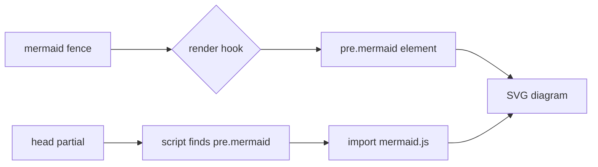
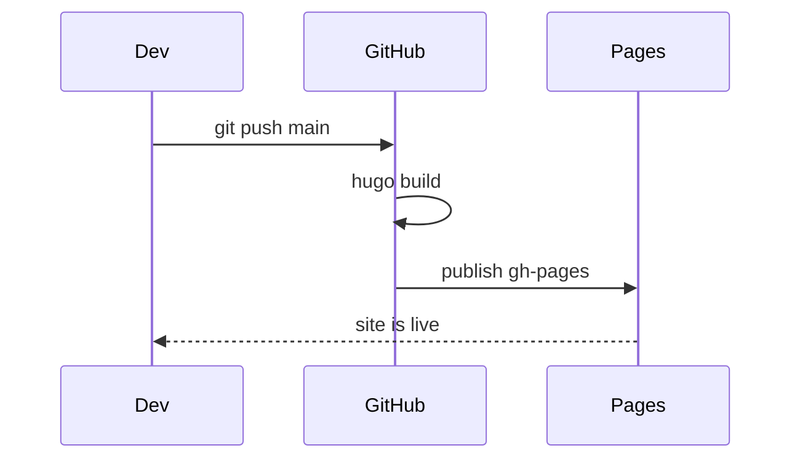
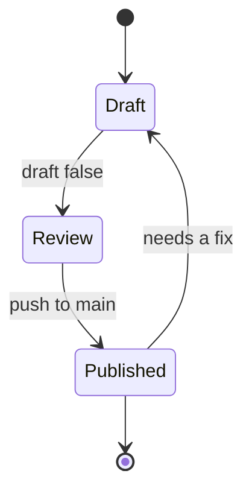

## Why bother

Screenshots of diagrams rot. They live outside the repository, nobody can diff them, and updating one means finding whatever tool drew it in the first place. [Mermaid](https://mermaid.js.org/) solves that by describing the diagram in text, right inside the Markdown file, and drawing it in the browser.

Hugo does not ship Mermaid support, but it gives you the one hook you need: a **code block render hook** that intercepts fenced blocks by language. Three small files are enough — no shortcodes and no build step.

## How the pieces fit



The render hook rewrites the fence into a plain `<pre>` element instead of running it through the syntax highlighter. A small module script in the page head then looks for those elements and, only if it finds any, pulls in the library.

## Step 1 — The render hook

Hugo looks for a template named after the language of the fence. Create `layouts/_default/_markup/render-codeblock-mermaid.html`:

```go-html-template
<pre class="mermaid">
{{- .Inner | htmlEscape | safeHTML -}}
</pre>
```

`.Inner` is the raw text between the fences. `htmlEscape` matters — diagram labels frequently contain `<`, `>` or `&`, and without escaping the browser would try to parse them as markup. `safeHTML` then stops Hugo from escaping the result a second time.

> **Path note:** Hugo 0.146 moved render hooks from `layouts/_default/_markup/` to `layouts/_markup/`. The old path still works, so it is the safer choice if you are pinning an older Hugo in CI. Check `hugo version` before deciding.

## Step 2 — The trap: `partialCached`

The Hugo documentation suggests flagging the page from inside the hook and reading that flag further down the template, so the library only loads where a diagram exists:

```go-html-template
{{- /* in the render hook */ -}}
{{- .Page.Store.Set "hasMermaid" true -}}

{{- /* in a partial near the end of the page */ -}}
{{- if .Store.Get "hasMermaid" }} ... {{ end }}
```

That is sound advice in general, and on PaperMod it silently does nothing. Look at how the theme's `baseof.html` calls its footer:

```go-html-template
{{ partialCached "footer.html" . .Layout .Kind (.Param "hideFooter") (.Param "ShowCodeCopyButtons") -}}
```

`partialCached` renders a partial once and reuses that output for every later call with the same cache key — and this key is built from the layout and the kind, with **no page identity in it**. Every post shares one cached footer. `extend_footer.html` is nested inside it, so a condition written there gets evaluated against whichever page Hugo happened to render first, and that single answer is baked into every other page. If the first one had no diagram, no page ever receives the script.

Nothing warns you. The build succeeds, the HTML looks plausible, and the diagrams simply sit there as text. The same applies to `extend_head.html`, because `head.html` is cached the same way.

The lesson generalises past Mermaid: **anything emitted from a PaperMod extension point must be identical on every page.** If the output has to vary, the decision belongs in the browser, not in the template.

## Step 3 — Decide at runtime instead

So put the same script on every page and let it check the DOM. Create `layouts/partials/extend_head.html`:

```go-html-template
<script type="module">
    const blocks = [...document.querySelectorAll('pre.mermaid')];
    if (blocks.length) {
        const { default: mermaid } = await import('https://cdn.jsdelivr.net/npm/mermaid@11/dist/mermaid.esm.min.mjs');

        // Mermaid replaces the block's text with an SVG, so keep the source for redraws.
        blocks.forEach((el) => { el.dataset.mermaidSrc = el.textContent; });

        const currentTheme = () => document.body.classList.contains('dark') ? 'dark' : 'default';

        const render = () => {
            blocks.forEach((el) => {
                el.removeAttribute('data-processed');
                el.textContent = el.dataset.mermaidSrc;
            });
            mermaid.initialize({ startOnLoad: false, theme: currentTheme() });
            return mermaid.run({ nodes: blocks });
        };

        await render();

        // PaperMod toggles `dark` on <body>; redraw so diagrams follow the theme.
        let lastTheme = currentTheme();
        new MutationObserver(() => {
            const theme = currentTheme();
            if (theme === lastTheme) return;
            lastTheme = theme;
            render();
        }).observe(document.body, { attributes: true, attributeFilter: ['class'] });
    }
</script>
```

Two properties make this safe to put in the head. Module scripts are deferred by default, so the document is fully parsed before the first line runs and `querySelectorAll` sees every diagram. And `import()` is a function call rather than a static import, so the roughly one megabyte of Mermaid is fetched only when the `if` passes. Pages without diagrams pay for a few hundred bytes of inline script and nothing else.

The rest handles the theme toggle. Mermaid renders the SVG once and marks the element `data-processed`, so it will not touch it again — switching to dark mode would otherwise leave you with a white diagram on a dark page. Caching the source text up front, then restoring it and clearing the marker, makes a redraw possible. The `MutationObserver` watches the `dark` class that PaperMod puts on `<body>`, and the `lastTheme` check keeps unrelated class changes from causing pointless redraws.

## Step 4 — Undo the code block styling

The diagram still lives inside a `<pre>`, so it inherits the theme's code block look: grey background, border, monospace padding. PaperMod concatenates any CSS found in `assets/css/extended/`, so drop a file there — `assets/css/extended/mermaid.css`:

```css
pre.mermaid {
    background: none;
    border: 0;
    padding: 0;
    margin: var(--gap) 0;
    text-align: center;
    overflow-x: auto;
}

pre.mermaid svg {
    max-width: 100%;
    height: auto;
}
```

`overflow-x: auto` is the one that saves you on mobile: wide sequence diagrams scroll inside their own box instead of stretching the page.

## Using it

Write a fenced block with `mermaid` as the language and nothing else about the workflow changes:

````markdown

````

Which renders as:


Mermaid covers a good deal more than flowcharts. A state diagram, for instance:



The full grammar — class diagrams, entity relationship diagrams, Gantt charts, git graphs, pie charts — is in the [Mermaid documentation](https://mermaid.js.org/intro/), and the [live editor](https://mermaid.live/) is the fastest way to get a diagram right before pasting it into a post.

## Things worth knowing

**Check the rendered DOM, not the Markdown.** A script that never got emitted and a diagram with a syntax error look identical in the source file. Open the page and confirm the `<pre class="mermaid">` element actually contains an `<svg>` child — that is the check that tells a template problem apart from a diagram problem.

**Diagrams need JavaScript.** Until the module loads, the reader sees the diagram source as plain text. That is a deliberate trade — it degrades to something readable rather than to nothing — but it also means a brief flash of source on slow connections. Hiding the block until `data-processed` appears removes the flash, at the cost of showing nothing at all when the CDN is blocked.

**Pin the major version.** `mermaid@11` in the URL lets jsDelivr serve the latest 11.x patch while protecting you from a breaking major release. If you would rather not depend on a CDN, download the ESM build into `assets/js/` and serve it through `resources.Get`.

**Indentation inside the fence is preserved.** Mermaid is whitespace-sensitive in places, and `.Inner` hands over the text exactly as written, so keep the diagram body indented consistently.
