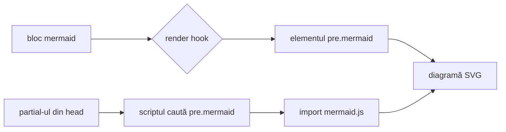
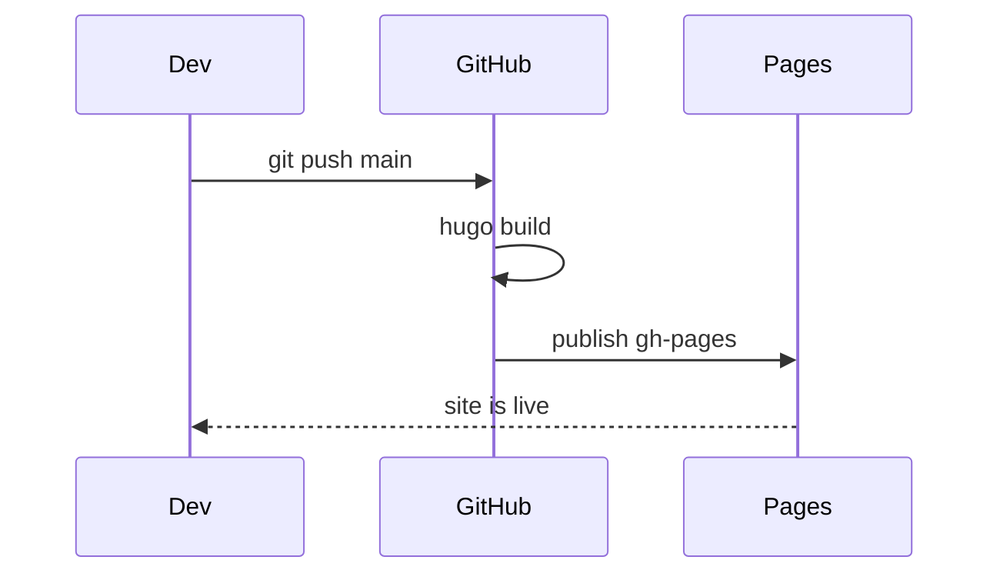
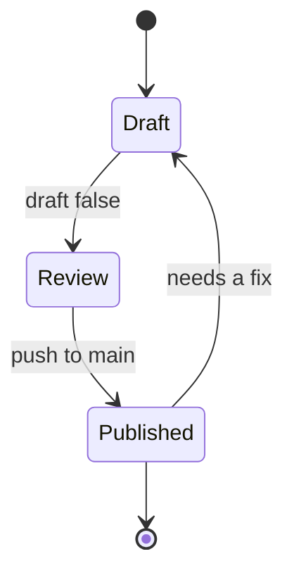

## De ce merită

Capturile de ecran cu diagrame se învechesc. Stau în afara repository-ului, nimeni nu le poate compara cu `diff`, iar ca să actualizezi una trebuie mai întâi să găsești unealta cu care a fost desenată. [Mermaid](https://mermaid.js.org/) rezolvă problema: descrii diagrama ca text, direct în fișierul Markdown, iar desenul se face în browser.

Hugo nu vine cu suport Mermaid, dar îți oferă exact mecanismul necesar: un **render hook pentru blocuri de cod**, care interceptează blocurile marcate cu un anumit limbaj. Trei fișiere mici sunt suficiente — fără shortcode-uri și fără pas suplimentar de build.

## Cum se leagă piesele



Render hook-ul transformă blocul într-un element `<pre>` simplu, în loc să îl trimită prin colorarea sintaxei. Un mic script de tip modul, aflat în head-ul paginii, caută apoi acele elemente și, numai dacă găsește vreunul, aduce librăria.

## Pasul 1 — Render hook-ul

Hugo caută un template numit după limbajul blocului. Creează `layouts/_default/_markup/render-codeblock-mermaid.html`:

```go-html-template
<pre class="mermaid">
{{- .Inner | htmlEscape | safeHTML -}}
</pre>
```

`.Inner` este textul brut dintre delimitatori. `htmlEscape` contează — etichetele diagramelor conțin frecvent `<`, `>` sau `&`, iar fără escaping browser-ul ar încerca să le interpreteze ca markup. `safeHTML` împiedică apoi Hugo să escapeze rezultatul a doua oară.

> **Notă despre cale:** Hugo 0.146 a mutat render hook-urile din `layouts/_default/_markup/` în `layouts/_markup/`. Calea veche funcționează în continuare, deci este alegerea mai sigură dacă ai o versiune mai veche de Hugo fixată în CI. Verifică `hugo version` înainte să decizi.

## Pasul 2 — Capcana: `partialCached`

Documentația Hugo sugerează să marchezi pagina din interiorul hook-ului și să citești acel marcaj mai jos în template, ca librăria să se încarce doar acolo unde există o diagramă:

```go-html-template
{{- /* în render hook */ -}}
{{- .Page.Store.Set "hasMermaid" true -}}

{{- /* într-un partial de la finalul paginii */ -}}
{{- if .Store.Get "hasMermaid" }} ... {{ end }}
```

Este un sfat corect în general, iar pe PaperMod nu face absolut nimic. Uită-te cum apelează tema footer-ul, în `baseof.html`:

```go-html-template
{{ partialCached "footer.html" . .Layout .Kind (.Param "hideFooter") (.Param "ShowCodeCopyButtons") -}}
```

`partialCached` randează un partial o singură dată și refolosește rezultatul la orice apel ulterior cu aceeași cheie de cache — iar cheia aceasta este construită din layout și kind, **fără nicio identitate de pagină în ea**. Toate articolele împart un singur footer memorat. `extend_footer.html` este cuprins în el, deci o condiție scrisă acolo se evaluează pe prima pagină pe care s-a întâmplat să o randeze Hugo, iar acel unic răspuns ajunge pe toate celelalte pagini. Dacă prima nu avea diagrame, nicio pagină nu primește vreodată scriptul.

Nimic nu te avertizează. Build-ul reușește, HTML-ul pare plauzibil, iar diagramele rămân pur și simplu text. Același lucru este valabil și pentru `extend_head.html`, pentru că `head.html` este memorat la fel.

Lecția depășește cazul Mermaid: **orice generezi dintr-un punct de extensie PaperMod trebuie să fie identic pe fiecare pagină.** Dacă rezultatul trebuie să difere, decizia îi aparține browser-ului, nu template-ului.

## Pasul 3 — Decide la runtime

Așadar pune același script pe fiecare pagină și lasă-l să verifice DOM-ul. Creează `layouts/partials/extend_head.html`:

```go-html-template
<script type="module">
    const blocks = [...document.querySelectorAll('pre.mermaid')];
    if (blocks.length) {
        const { default: mermaid } = await import('https://cdn.jsdelivr.net/npm/mermaid@11/dist/mermaid.esm.min.mjs');

        // Mermaid înlocuiește textul blocului cu un SVG, deci păstrăm sursa pentru redesenări.
        blocks.forEach((el) => { el.dataset.mermaidSrc = el.textContent; });

        const currentTheme = () => document.body.classList.contains('dark') ? 'dark' : 'default';

        const render = () => {
            blocks.forEach((el) => {
                el.removeAttribute('data-processed');
                el.textContent = el.dataset.mermaidSrc;
            });
            mermaid.initialize({ startOnLoad: false, theme: currentTheme() });
            return mermaid.run({ nodes: blocks });
        };

        await render();

        // PaperMod comută clasa `dark` pe <body>; redesenăm ca diagramele să urmeze tema.
        let lastTheme = currentTheme();
        new MutationObserver(() => {
            const theme = currentTheme();
            if (theme === lastTheme) return;
            lastTheme = theme;
            render();
        }).observe(document.body, { attributes: true, attributeFilter: ['class'] });
    }
</script>
```

Două proprietăți fac sigură plasarea în head. Scripturile de tip modul sunt amânate implicit, deci documentul este complet parsat înainte să ruleze prima linie, iar `querySelectorAll` vede toate diagramele. Iar `import()` este un apel de funcție, nu un import static, deci cele aproximativ o mie de kiloocteți de Mermaid se descarcă doar când condiția `if` trece. Paginile fără diagrame plătesc câteva sute de octeți de script inline și nimic altceva.

Restul se ocupă de comutarea temei. Mermaid generează SVG-ul o singură dată și marchează elementul cu `data-processed`, deci nu se va mai atinge de el — altfel, trecerea pe tema întunecată ți-ar lăsa o diagramă albă pe o pagină neagră. Salvarea textului sursă la început, urmată de restaurarea lui și de ștergerea marcajului, face redesenarea posibilă. `MutationObserver` urmărește clasa `dark` pe care PaperMod o pune pe `<body>`, iar verificarea `lastTheme` previne redesenări inutile la alte schimbări de clasă.

## Pasul 4 — Anulează stilul de bloc de cod

Diagrama trăiește tot într-un `<pre>`, deci moștenește aspectul de bloc de cod al temei: fundal gri, bordură, padding monospace. PaperMod concatenează orice CSS găsit în `assets/css/extended/`, așa că pune acolo un fișier — `assets/css/extended/mermaid.css`:

```css
pre.mermaid {
    background: none;
    border: 0;
    padding: 0;
    margin: var(--gap) 0;
    text-align: center;
    overflow-x: auto;
}

pre.mermaid svg {
    max-width: 100%;
    height: auto;
}
```

`overflow-x: auto` este regula care te salvează pe mobil: diagramele de secvență late derulează în propria casetă, în loc să lățească pagina.

## Cum îl folosești

Scrie un bloc marcat cu limbajul `mermaid` și nimic altceva din fluxul tău de lucru nu se schimbă:

````markdown

````

Care se afișează astfel:


Mermaid acoperă mult mai mult decât diagramele de flux. O diagramă de stări, de exemplu:



Gramatica completă — diagrame de clase, diagrame entitate-relație, diagrame Gantt, git graph-uri, diagrame circulare — se găsește în [documentația Mermaid](https://mermaid.js.org/intro/), iar [editorul live](https://mermaid.live/) este cea mai rapidă cale să reglezi o diagramă înainte să o lipești într-un articol.

## Lucruri bune de știut

**Verifică DOM-ul randat, nu fișierul Markdown.** Un script care nu a fost generat niciodată și o diagramă cu eroare de sintaxă arată identic în sursă. Deschide pagina și confirmă că elementul `<pre class="mermaid">` chiar conține un copil `<svg>` — aceasta este verificarea care deosebește o problemă de template de una de diagramă.

**Diagramele au nevoie de JavaScript.** Până se încarcă modulul, cititorul vede sursa diagramei ca text simplu. Este un compromis asumat — degradarea duce la ceva lizibil, nu la nimic — dar înseamnă și o clipire scurtă a sursei pe conexiuni lente. Ascunderea blocului până apare `data-processed` elimină clipirea, cu prețul de a nu afișa absolut nimic atunci când CDN-ul este blocat.

**Fixează versiunea majoră.** `mermaid@11` în URL îi permite jsDelivr să servească cel mai recent patch din seria 11.x, protejându-te în același timp de o versiune majoră cu modificări incompatibile. Dacă preferi să nu depinzi de un CDN, descarcă build-ul ESM în `assets/js/` și servește-l prin `resources.Get`.

**Indentarea din interiorul blocului este păstrată.** Mermaid este sensibil la spațiere în anumite locuri, iar `.Inner` predă textul exact așa cum a fost scris, deci ține corpul diagramei indentat consecvent.
